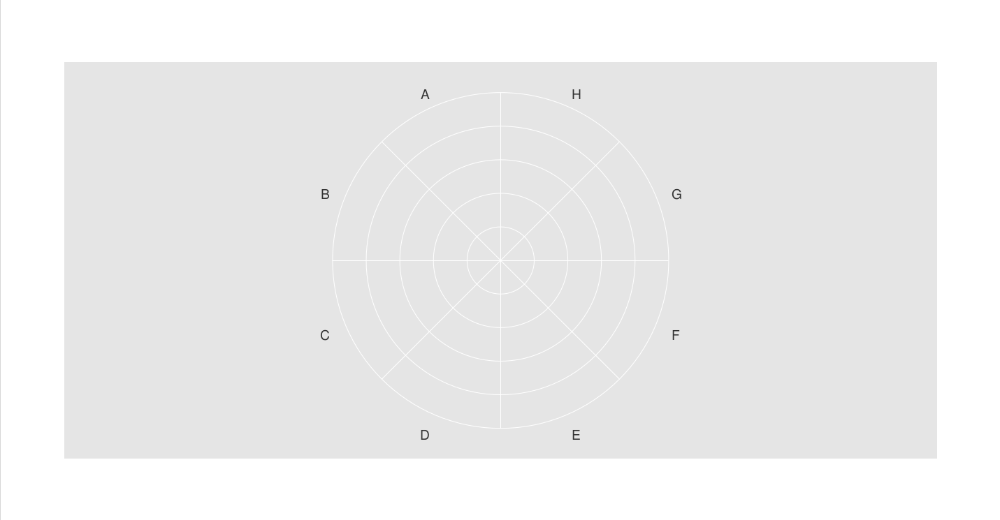
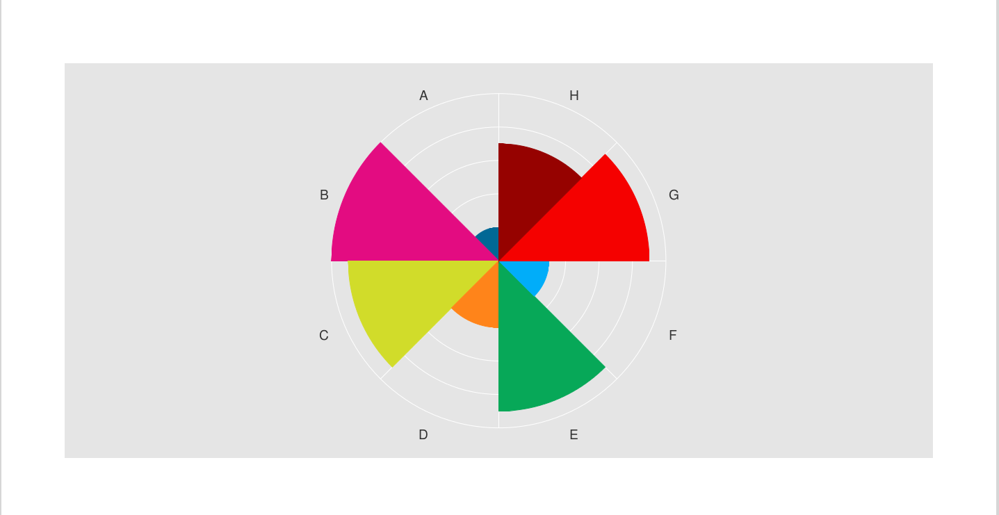
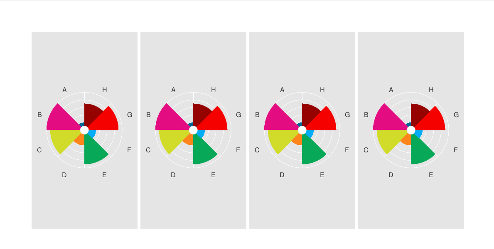

## iText 基础
### 基础介绍
iText是著名的开放源码的站点sourceforge一个项目，是用于生成PDF文档的一个java类库。通过iText不仅可以生成PDF或rtf的文档，而且可以将XML、Html文件转化为PDF文件。
本文仅讨论如何使用iTextApi生成PDF文件，不讨论关于xml，html相关的pdf转换特性。

### 基础API
#### iText Document
Document是iText中一个通用的文档类，所有我本内容最终都会被附加或者说填充到一个文档中，此文档对象也会在子元素被添加的同时回调一些由listener指定的回调接口！
##### 注意
* 当一个文档对象创建完成得到实例之后，我们就可以为这个文档实例添加一些元数据，比如文档所属用户，文档简要描述等等。
* 当一个文档对象创建完成得到实例之后，我们可以为文档指定文档页眉和页脚
* 只有先打开文档(调用`document.open()`)之后我们才能够向文档中写入内容
* 打开文档之前，需要使用一个DocumentWriter的实现类比如PdfWriter的实例来将Document和一个OutputStream绑定到一起，当调用`close()`方法，文档内容将被写入到输出流中
* 一旦文档被打开，将无法再向文档中添加元数据
* 如果你在某一页面调整了页眉或者页脚，接下来的后续页面都会被改变
* 一旦文档被关闭，与当前文档关联的所有listener也都将被关闭
##### 核心API
```java
public class Document implements DocListener, IAccessibleElement {
    /**
    * Methods extended from DocListener
    */
    public void open();  //打开文档
    public void close();  //关闭万恶的囊
    public boolean newPage();  //开始新的一页
    public boolean setPageSize(Rectangle pageSize);    //设置文档页面大小
    public boolean setMargins(float marginLeft, float marginRight, float marginTop, float marginBottom);    //设置文档页面边距
    public void setPageCount(int pageN);    //设置文档页码
    public void resetPageCount();    //重置当前文档页码为0
    
    /**
    * Fields declared document itself 
    */
    protected ArrayList<DocListener> listeners = new ArrayList<>();    //关联的listener
    protected boolean open;    //文档是否已被打开
    protected boolean close;    //文档是否已被关闭
    protected Rectangle pageSize;    //文档页面大小
    protected float marginLeft = 0;    //文档左边距
    protected float marginRight = 0;    //文档右边距
    protected float marginTop = 0;    //文档上边距
    protected float marginBottom = 0;    //文档下边距
    
    /**
    * Constructor method 
    */
    public Document();    //same as Document(PageSize.A4); A4 = new RectangleReadOnly(595,842)
    public Document(Rectangle pageSize);    //same as Document(pageSize, 36, 36, 36, 36)
    public Document(Rectangle pageSize, float marginLeft, float marginRight,float marginTop, float marginBottom);
    
    
    /**
    * Methods declared document itself 
    */
    public void addDocListener(DocListener listener);
    public void removeDocListener(DocListener listener);
    public boolean add(Element element);
    public boolean addHeader(String name, String content);    //为文档添加一个header
    public boolean addTitle(String title);    //为文档添加一个title
    public boolean addSubject(String subject);    //为文档添加一个主题
    public boolean addKeywords(String keywords);    //为文档添加一系列关键字
    public boolean addAuthor(String author);    //添加文档的作者
    public boolean addCreator(String creator);    //添加文档创建者名称
    public boolean addCreationDate();    //设定文档创建时间，即当前时间
}
```

##### 实例代码
```java
public class DocumentApiTest{
    public static void main(String[] args) throws Exception {
        //创建一个空白文档，无参构造函数相当于new Document(PageSize.A4,36,36,36,36)
        Document document = new Document();
        
        //创建一个输出流，此处我们使用文件输出流
        OutputStream outputStream = new FileOutputStream(new File("helloWorld.pdf"));
        
        //将目标文档同输出流绑定到一起
        PdfWriter.getInstance(document , outputStream);
        
        //设置文档元数据
        document.addAuthor("San Zhang"); 
        document.addSubject("Test for Document Api!"); 
        
        //打开文档
        document.open(); 
        
        //添加内容
        document.add(new Paragraph("Hello world！"));
        
        //关闭文档
        document.close();
    }
}
```

#### iText Element
文本元素的通用接口。
##### 核心API
```java
public interface Element{
    int type();    //当前元素类型
    boolean isContent();    //当前元素是否是一个content object
    boolean isNestable();    //当前元素是否可以被嵌入到其他元素中
    List<Chunk> getChunks();    //获取当前元素全部的chunks
    
    /**
    * 对type的诸多常量定义
    */
    int HEADER = 0;
    int TITLE = 1;
    int TITLE = 1;
    int SUBJECT = 2;
    int KEYWORDS = 3;
    int AUTHOR = 4;
    int PRODUCER = 5;
    int CREATIONDATE = 6;
    int CREATOR = 7;
    int LANGUAGE = 8;
    
    int CHUNK = 10;
    int PHRASE = 11;
    int PARAGRAPH = 12;
    int SECTION = 13;
    int LIST = 14;
    int LISTITEM = 15;
    int CHAPTER = 16;
    int ANCHOR = 17;
    
    int PTABLE = 23;
    int ANNOTATION = 29;
    int RECTANGLE = 30;
    int JPEG = 32;
    int JPEG2000 = 33;
    int IMGRAW = 34;
    int IMGTEMPLATE = 35;
    int JBIG2 = 36;
    int DIV = 37;
    int BODY = 38;
    int MARKED = 50;
    int YMARK = 55;
    
    int ALIGN_UNDEFINED = -1;    //段落对齐方式：同ALIGN_LEFT
    int ALIGN_LEFT = 0;    //段落水平左对齐
    int ALIGN_CENTER = 1;    //段落水平居中对其
    int ALIGN_RIGHT = 2;    //段落属性右对齐
    int ALIGN_JUSTIFIED = 3;    //段落水平展开，除了最后一行，其余各行水平伸展占据整行
    int ALIGN_TOP = 4;    //段落垂直靠顶部对齐
    int ALIGN_MIDDLE = 5;    //段落垂直居中对齐
    int ALIGN_BOTTOM = 6;    //段落处置靠底部对齐
    int ALIGN_BASELINE = 7;    //段落靠基线对齐
    int ALIGN_JUSTIFIED_ALL = 8;    //段落水平展开，各行均水平伸展占据整行
}
```

#### iText Chunk
可以被添加到文档中的最小的文本单位。许多其他元素都被拆分成一个或多个Chunk，每一个Chunk都关联了一个字符串以及对应的字体。关于chunk的布局参数等则应该在被拆分的元素内部进行定义。
##### 核心API
```java
public class Chunk implements Element, IAccessibleElement {
    protected StringBuffer content;    //关联的文本内容
    protected Font font;    //关联的字体
    
    public Chunk();
    public Chunk(final char c);
    public Chunk(final char c, final Font font);
    public Chunk(final String content);
    public Chunk(final String content, final Font font);
}
```
##### 示例代码
```java
public class ChunkApiTest{
    public static void main(String[] args){
        //...
        
        Chunk chunk = new Chunk(
                "Hello world",
                FontFactory.getFont(FontFactory.COURIER, 20, Font.ITALIC, new BaseColor(255, 0,0))
        );  
        document.add(chunk);
        
        //...
    }
}
```

#### iText Phrase
一个Phrase是一系列Chunk的集合。
每一个Phrase都有一个主字体，所有添加到此Phrase中的Chunk都默认使用这个字体，但是每一个Chunk仍然可以自定义字体。所有的Chunk使用同一个leading（行间距）
#### 核心API
```java
public class Phrase extends ArrayList<Element> implements TextElementArray {
    protected float leading;
    protected float multipliedLeading;
    protected Font font;
    
    public Phrase();    //same as Phrase(16);
    public Phrase(final float leading);
    public Phrase(final Chunk chunk);
    public Phrase(final float leading, final Chunk chunk);
    public Phrase(final String string);    //Phrase(Float.NaN, string, new Font())
    public Phrase(final String string, final Font font);    //Phrase(Float.NaN, string, font)
    public Phrase(final float leading, final String string);  //Phrase(leading, string, new Font())
    public Phrase(final float leading, final String string, final Font font);
    
    public int type() {
        return Element.PHRASE;
    }
    
    public boolean add(final String s);
    public boolean add(final Element element);
    protected boolean addChunk(final Chunk chunk);
}
```
##### 示例代码
```java
public class PhraseApiTest{
    public static void main(String[] args){
        //...
        
        // When no parameters are passed, the default leading = 16
        Phrase phrase0 = new Phrase();
        Phrase phrase1 = new Phrase("this is a phrase");
        
        // In this example the leading is passed as a parameter
        Phrase phrase2 = new Phrase(16, "this is a phrase with leading 16");
        
        // When a Font is passed (explicitly or embedded in a chunk), the default leading = 1.5 * size of the font
        Phrase phrase3 = new Phrase("this is a phrase with a red, normal font Courier, size 12", FontFactory.getFont(FontFactory.COURIER, 12, Font.NORMAL, new Color(255, 0, 0)));
        Phrase phrase4 = new Phrase(new Chunk("this is a phrase"));
        Phrase phrase5 = new Phrase(18, new Chunk("this is a phrase", FontFactory.getFont(FontFactory.HELVETICA, 16, Font.BOLD, new Color(255, 0, 0))));
        
        //document.add(...)
        
        //...
    }
}
```
#### iText BaseColor
iText 颜色工具类
#####  核心API
```java
public class BaseColor {
    //rgba值
    private int value;
    
    //构造函数
    public BaseColor(final int red, final int green, final int blue, final int alpha);
    public BaseColor(final int red, final int green, final int blue);    //默认 alpha 为100,即完全不透明
    public int getRGB();
    public int getRed();
    public int getGreen();
    public int getBlue();
    public int getAlpha();
    
    //颜色常量
    public static final BaseColor WHITE = new BaseColor(255, 255, 255);
    public static final BaseColor LIGHT_GRAY = new BaseColor(192, 192, 192);
    public static final BaseColor GRAY = new BaseColor(128, 128, 128);
    public static final BaseColor DARK_GRAY = new BaseColor(64, 64, 64);
    public static final BaseColor BLACK = new BaseColor(0, 0, 0);
    public static final BaseColor RED = new BaseColor(255, 0, 0);
    public static final BaseColor PINK = new BaseColor(255, 175, 175);
    public static final BaseColor ORANGE = new BaseColor(255, 200, 0);
    public static final BaseColor YELLOW = new BaseColor(255, 255, 0);
    public static final BaseColor GREEN = new BaseColor(0, 255, 0);
    public static final BaseColor MAGENTA = new BaseColor(255, 0, 255);
    public static final BaseColor CYAN = new BaseColor(0, 255, 255);
    public static final BaseColor BLUE = new BaseColor(0, 0, 255);
}
```

#### iText BaseFont
BaseFont为iText字体基类，可根据自体文件创建或加载对应字体。
##### 核心API
```java
public abstract class BaseFont{
    public static BaseFont createFont();    //创建一个基于默认字体Helvetica的自体，且不嵌入
    public static BaseFont createFont(String name, String encoding, boolean embedded);    //按照指定自体文件名称加载自体文件，并创建字体
}
```
##### 示例代码
```java
public class BaseFontApiTest{
    public static void main(String[] args){
        String MSYH_FONT_STR = "msyh.ttf";    //加载系统classPath路径下的由文件名msyh.ttf指定的微软雅黑字体
        
        baseFontChinese = BaseFont.createFont(MSYH_FONT_STR, BaseFont.IDENTITY_H, false);     
    }
}
```
##### 注意
***在使用maven等包管理工具管理项目时，一般我们会将字体等资源文件放到项目的resources资源文件目录，在项目的打包阶段，maven编译插件通常会对资源文件进行编译，这会导致字体文件被损坏，若要保证自体文件的正常使用，请设置插件的filtering为false***
```xml
<project xmlns="http://maven.apache.org/POM/4.0.0" xmlns:xsi="http://www.w3.org/2001/XMLSchema-instance"
         xsi:schemaLocation="http://maven.apache.org/POM/4.0.0 http://maven.apache.org/xsd/maven-4.0.0.xsd">
    <!--省略部分无关代码-->
    <build>
        <resources>
            <resource>
                <directory>src/main/resources</directory>
                <includes>
                    <include>**/*.tty</include>
                </includes>
                <filtering>false</filtering>
            </resource>
        </resources>
    </build>
</project>
```
#### iText Font
一个字体描述类，包含字体类型，大小，样式以及颜色
##### 核心API
```java
public class Font implements Comparable<Font> {
    //内部枚举，字体样式
    public enum FontStyle {
        NORMAL("normal"), 
        BOLD("bold"), 
        ITALIC("italic"), 
        OBLIQUE("oblique"), 
        UNDERLINE("underline"), 
        LINETHROUGH("line-through");

        private String code;

        FontStyle(final String code) {
            this.code = code;
        }

        /**
         * @return a string, the text value of this style.
         * @since 5.0.6
         */
        public String getValue() {
            return code;
        }
    }
    
    private float size;
    private int style;
    private BaseColor color;
    private BaseFont baseFont;
    
    /**
    * 构造函数
    */
    public Font(final BaseFont bf, final float size, final int style, final BaseColor color);
}
```
##### 示例代码
```java
public class FontApiTest {
    public static void main(String[] args){
        BaseColor fontColor = new BaseColor(0x59, 0x57, 0x57, 0xff);
        int fontSize = 8;
        int fontStyle = Font.NORMAL;
        BaseFont baseFontChinese = BaseFont.createFont(MSYH_FONT_STR, BaseFont.IDENTITY_H, false);
        Font chineseFont = new Font(baseFontChinese, fontSize, fontStyle, fontColor);
    }
}
```

#### iText Rectangle
Rectangle是对一个矩形区域的抽象。
##### 核心API
```java
public class Rectangle implements Element {
    protected float llx;    //矩形左下角x位置（lower left x-coordinate）
    protected float lly;    //矩形左下角y位置（lower left y-coordinate）
    protected float urx;    //矩形右上角x位置（upper right x-coordinate）
    protected float ury;    //矩形右上角y位置（upper right y-coordinate）
    
    protected int rotation;    //矩形旋转角度(是角度不是弧度)
    
    protected BaseColor backgroundColor;    //矩形背景颜色
    
    protected int border;    //当前矩形是否有边框，比如如果等于3（TOP | BOTTOM），表示有上下边框
    public static final int UNDEFINED = -1;    //未定义是否有Border
    public static final int TOP = 1;    //当前矩形有上边框
    public static final int BOTTOM = 2;    //当前矩形有下边框
    public static final int LEFT = 4;    //当前矩形有左边框
    public static final int RIGHT = 8;    //当前矩形有右边框
    public static final int NO_BORDER = 0;    //当前矩形没有任何边框
    public static final int BOX = TOP + BOTTOM + LEFT + RIGHT;    //当前矩形有上下左右边框
    
    protected float borderWidth;    //矩形边框宽度
    protected float borderWidthLeft;
    protected float borderWidthRight;
    protected float borderWidthTop;
    protected float borderWidthBottom;
    
    protected BaseColor borderColor;    //矩形边框颜色
    protected BaseColor borderColorLeft;
    protected BaseColor borderColorRight;
    protected BaseColor borderColorTop;
    protected BaseColor borderColorBottom;
    
    public Rectangle(final float urx, final float ury);    //with default llx=0 and lly = 0 and rotate=0
    public Rectangle(final float llx, final float lly, final float urx, final float ury);    //with default rotate=0
    public Rectangle(final float llx, final float lly, final float urx, final float ury, final int rotation);
    
}
```

#### iText PdfPCell
iText单元格。是PdfPTable的基本元素。关于单元格的设计可以参考html的盒子模型。之后所有的控件都是由PdfPCell扩展而来。具体细节之后会详述。
##### 核心API
```java
public class PdfPCell extends Rectangle implements IAccessibleElement {
    private ColumnText column;
    
    private int verticalAlignment;    //当前单元格竖直方向对齐格式
    
    private float paddingLeft;    //单元格内边距，默认均为2
    private float paddingRight;
    private float paddingTop;
    private float paddingBottom;
    
    private float fixedHeight;    //单元格高度
    private float calculatedHeight;    //单元格高度
    private float minimumHeight;    //单元格最小高度
    private float cachedMaxHeight;
    
    private boolean noWrap;    //单元格是否对内容进行包裹，如果true且内容较多，会换行显示。如果为false会对内容进行截断。
    
    private PdfPTable table;    //附属的表格
    
    private int colspan = 1;    //当前单元格占据表格的列数
    private int rowspan = 1;    //当前单元格占据表格的行数
    
    private Image image;
    
    private PdfPCellEvent cellEvent;    //当前单元格关联的单元格布局函数
    
    protected Phrase phrase;     //单元格内容
    
    private int rotation;     //单元格旋转角度 可选值0,90,180,270
    
    public PdfPCell();    //构造函数
    public PdfPCell(Phrase phrase);
    public PdfPCell(Image image);
    public PdfPCell(Image image, boolean fit);
    
    public void setColspan(int colspan);    //设置单元格占据的列
    public void setRowspan(int rowspan);    //设置单元格占据的行
    public void setCellEvent(PdfPCellEvent cellEvent);    //设置单元格布局实现
    public void setNoWrap(boolean noWrap);    //设置是否wrap
    public void setFixedHeight(float fixedHeight);    //设置单元格固定高度
    public void setLeading(float fixedLeading, float multipliedLeading);   //leading = fixedLeading + multipliedLeading * maxFontSize 
}
```
##### 注意
如果某个表格被拆分为多列，比如列数为columnCountOfTable，如果最后一行中所有单元格的列数加起来都不足columnCountOfTable，那么这一行内的单元格将不会被展示出来。如果想让单元格展示出来，必须利用一些空白单元格对最后一行进行补齐。
##### 示例代码
```java
public class PdfPCellApiTest{
    public static void main(String[] args){
        //...
    
        PdfPTable mainFrame = new PdfPTable(12);    //the table will be split to 12 columns
        
        PdfPCell oneColumnCell;
        int cellCount = 12;    //if set cellCount=11,no cell will be shown.
        for (int index = 0;index < cellCount;index ++){
            oneColumnCell = new PdfPCell(new Phrase(new Chunk("cell " + index)));
            oneColumnCell.setColspan(1);
            mainFrame.add(oneColumnCell);
        }
        
        //...
    }
}
```

#### iText PdfPTable
iText表格类，一个表格可以被给定一个绝对位置，也可以作为一个Element被放置到一个Document中，如果被放置到一个Document中，那么这个表格占据这个document除开上下左右边距之后的整个空间。
在日常的项目实现中我们一般会使用表格来进行布局。参照bootstrap中的一些思想。我们一般会将表格框架拆分为12列或者是24列。具体为什么是12列或者24列，大家可以自己想一下。
##### 核心API
PdfPTable包含的API众多，我们此处只罗列几个比较重要的。其实对于PdfPTable主要是理解为什么需要将其拆分为12列或者是24列，其他关于具体怎么使用它进行布局的部分实在是太过简单，毕竟流式布局实在没什么好说的。
```java
public class PdfPTable implements LargeElement, Spaceable, IAccessibleElement {
    protected ArrayList<PdfPRow> rows;    //当前表格的行
    protected float widthPercentage;    //当前表格占据的宽度百分比
    private boolean splitRows;    //是否拆分页脚最后一个单元格（如果页面剩余宽度不够一个单元格的高度）
    private boolean splitLate ;
    
    public PdfPTable(final int numColumns);    //构造函数指定表格列数目
    public PdfPCell addCell(final PdfPCell cell);    //向当前表格中添加一个单元格
    public void setWidthPercentage(final float widthPercentage);    //设置当前表格宽度百分比
    public void setSplitRows(final boolean splitRows);
    public boolean isSplitLate();
}
```
##### 示例代码
```java
public class PdfPTableTest{
    public static void main(String[] args){
        //...
        
        PdfPTable mainFrame = new PdfPTable(12);
        mainFrame.setWidthPercentage(100);

        PdfPCell oneColumnCell = new PdfPCell(new Phrase(new Chunk("one   column cell")));
        oneColumnCell.setColspan(1);

        PdfPCell twoColumnCell = new PdfPCell(new Phrase(new Chunk("two   column cell")));
        oneColumnCell.setColspan(2);

        PdfPCell threeColumnCell = new PdfPCell(new Phrase(new Chunk("three column cell")));
        oneColumnCell.setColspan(3);

        PdfPCell fourColumnCell = new PdfPCell(new Phrase(new Chunk("four  column cell")));
        oneColumnCell.setColspan(4);

        PdfPCell sixColumnCell = new PdfPCell(new Phrase(new Chunk("six   column cell")));
        oneColumnCell.setColspan(6);

        //第一行，两个占据一列的单元格，两个占据两列的单元格，一个占据六列的单元格
        mainFrame.addCell(oneColumnCell);
        mainFrame.addCell(oneColumnCell);
        mainFrame.addCell(twoColumnCell);
        mainFrame.addCell(twoColumnCell);
        mainFrame.addCell(sixColumnCell);

        //第二行，四个占据3列的单元格
        mainFrame.addCell(threeColumnCell);
        mainFrame.addCell(threeColumnCell);
        mainFrame.addCell(threeColumnCell);
        mainFrame.addCell(threeColumnCell);

        //第三行，三个占据四列的单元格
        mainFrame.addCell(fourColumnCell);
        mainFrame.addCell(fourColumnCell);
        mainFrame.addCell(fourColumnCell);
    }
}
```

## iText控件扩展
前面也提到过，对于iText,想要进行控件实现，那么就必须依赖于PdfPCell类以及PdfPCellEvent。
### PdfPCellEvent接口定义
```java
public interface PdfPCellEvent {
    /**
    * 此方法在单元格整个渲染流程的最后面被执行，普通的文本或者是复杂的图片将会通过由canvases指定的四种画布勾画到具体单元格中。四种画布索引如下：
    * 1）PdfPTable.BASECANVAS：最原始的画布，所有勾画到这个画布内容都会被置于单元格最底层
    * 2）PdfPTable.BACKGROUNDCANVAS：背景画布，所有勾画到这个画布的内容都会被置于背景层
    * 3）PdfPTable.LINECANVAS ：线画布，所有勾画到这个画布的内容都会被置于线层
    * 4）PdfPTable.TEXTCANVAS：文字画布，所有勾画到这个画布的内容都会被置于文字层，文字层是在单元格的最上层
    * 上述画布层按照指定属性依次在前一个画布的上层
    * 
    * 三个参数:
    * cell:当前单元格
    * position: 当前单元格所处位置
    * canvases：四种画布
    */
    void cellLayout(PdfPCell cell, Rectangle position, PdfContentByte[] canvases);
}
```
### How to example
本例中我们将会使用一个比较复杂的例子来讲述具体如何通过扩展PdfPCell来得到一个控件，这个控件的名称叫南丁格尔玫瑰图，不知道什么是南丁格尔玫瑰图的同学可以看百度一下。下面是南丁格尔玫瑰图的报读百科描述。

> 南丁格尔玫瑰图是弗罗伦斯·南丁格尔所发明的。又名为极区图 。是一种圆形的直方图。 南丁格尔自己常昵称这类图为鸡冠花图（coxcomb），并且用以表达军医院季节性的死亡率，对象是那些不太能理解传统统计报表的公务人员。


> 弗罗伦斯·南丁格尔  （英语：Florence Nightingale，1820年5月12日－1910年8月13日），英国护士和统计学家，出生于意大利的一个英国上流社会的家庭。在德国学习护理后，曾往伦敦的医院工作。于1853年成为伦敦慈善医院的护士长。


> 出于对资料统计的结果会不受人重视的忧虑，她发展出一种色彩缤纷的图表形式，让数据能够更加让人印象深刻。 这种图表形式有时也被称作「南丁格尔的玫瑰」，是一种圆形的直方图。 南丁格尔自己常昵称这类图为鸡冠花图（coxcomb），并且用以表达军医院季节性的死亡率，对象是那些不太能理解传统统计报表的公务人员。 她的方法打动了当时的高层，包括军方人士和维多利亚女王本人，于是医事改良的提案才得到支持。  

接下来我会一步一步的展示如何实现这个控件。
#### 注意事项
* 由于PdfPCell有一些基本的样式属性，其中一些属性比如border相关的我们需要禁用，为什么呢，因为通常我们控件的border会靠内一点，即我们会留出一点padding，这样当吧单元格放到表格中时不至于挤到一起。我们通过设置pdfPCell.border = Rectangle.NO_BORDER来禁用。
* 除了border相关的属性，还有一个就是单元格自带的backgroundColor属性,像上一点所说我们要使得控件展示出来时不至于挤到一起，会在padding的部分留白，但PdfPCell的默认backgroundColor是覆盖这一部分的。
#### 需求定义
##### 控件基本属性
* 
#### 编码
##### 第一步，控件基本骨架
前面也提到过，想要扩展控件，那么我们必须使用PdfPCell以及PdfPCellEvent这两个类，让我们的控件继承自PdfPCell并实现PdfPCellEvent，在PdfPCellEvent的doCellLayout回调中进行我们的控件勾画工作。
```java
/**
 * 南丁格尔玫瑰图
 *
 * @author wenchao
 */
public class NightingaleRoseDiagram extends PdfPCell implements PdfPCellEvent {
    public NightingaleRoseDiagram() {
    }

    @Override
    public void cellLayout(PdfPCell cell, Rectangle position, PdfContentByte[] canvases) {
        //draw component content here
    }
}
```
##### 第二步，控件基本属性“禁用”
根据前面注意事项所说，我们需要“禁用”边框以及背景色两个属性
```java
/**
 * 南丁格尔玫瑰图
 *
 * @author wenchao
 */
public class NightingaleRoseDiagram extends PdfPCell implements PdfPCellEvent {
    public NightingaleRoseDiagram() {
        disableTheDefaultFeature();
    }

    @Override
    public void cellLayout(PdfPCell cell, Rectangle position, PdfContentByte[] canvases) {

    }

    /**
     * 禁用控件自定义边框以及背景色
     */
    private void disableTheDefaultFeature(){
        this.setBorder(PdfPCell.NO_BORDER);
        this.setBackgroundColor(BaseColor.WHITE);
    }
}
```
##### 第三步，定义控件基本属性
南丁格尔玫瑰图内部是由扇区定义的，在笔者接触到的南丁格尔玫瑰图中这些扇区都是等分的，所以今天实现的南丁格尔玫瑰图扇区也会是等分的。
* 单元格背景色
* 待勾画控件以圆形或者圆环为基础框架，所以需要定义圆心（圆心在cellLayout回调中使用position确定），最大半径，最小半径。
* 具体有多少个扇区，由传入的扇区数据集合大小来确定
* 扇区基本数据,扇区半径，扇区背景色，扇区描述（扇区描述文字，扇区描述字体）
* 单元格高度，我们设定为最大圆半径 × 2 × 1.2


```java
/**
 * 南丁格尔玫瑰图
 *
 * @author wenchao
 */
public class NightingaleRoseDiagram extends PdfPCell implements PdfPCellEvent {
    private BaseColor bgColor;

    private static final float DEFAULT_HEIGHT_EXPAND_RATIO = 1.2f;

    private float innerRadius;
    private static final float MIN_INNER_RADIUS = 0;
    private static final float MAX_INNER_RADIUS_RATIO = 0.8f;

    private float outerRadius;
    private static final float MIN_OUTER_RADIUS = 50;
    private static final float MAX_OUTER_RADIUS = 80;

    private List<RoseDiagramItem> roseDiagramItems;

    public NightingaleRoseDiagram(BaseColor bgColor, float outerRadius, float innerRadius, List<RoseDiagramItem> roseDiagramItems) {
        this.bgColor = bgColor;
        this.outerRadius = normalize(outerRadius,MIN_OUTER_RADIUS,MAX_OUTER_RADIUS);
        this.innerRadius = normalize(innerRadius,MIN_INNER_RADIUS,MAX_INNER_RADIUS_RATIO * this.outerRadius);
        this.roseDiagramItems = roseDiagramItems;

        for (RoseDiagramItem roseDiagramItem:roseDiagramItems){
            roseDiagramItem.normalize(this.innerRadius,this.outerRadius);
        }

        this.setFixedHeight(this.outerRadius * 2 * DEFAULT_HEIGHT_EXPAND_RATIO);

        disableTheDefaultFeature();
    }

    @Override
    public void cellLayout(PdfPCell cell, Rectangle position, PdfContentByte[] canvases) {

    }

    /**
     * 禁用控件自定义边框以及背景色
     */
    private void disableTheDefaultFeature() {
        this.setBorder(PdfPCell.NO_BORDER);
        this.setBackgroundColor(BaseColor.WHITE);
    }

    public static class RoseDiagramItem {
        private String description;
        private Font descriptionFont;
        private float radius;
        private BaseColor bgColor;

        public RoseDiagramItem(String description, Font descriptionFont, float radius, BaseColor bgColor) {
            this.description = description;
            this.descriptionFont = descriptionFont;
            this.radius = radius;
            this.bgColor = bgColor;
        }

        public void normalize(float innerRadius,float outerRadius){
            this.radius = NightingaleRoseDiagram.normalize(radius,innerRadius,outerRadius);
        }
    }

    /**
     * 按照最大最小值对指定半径做处理
     * @param radius 当前半径
     * @param minRadius 最小半径
     * @param maxRadius 最大半径
     * @return 如果当前半径小于最小半径，返回最小半径，如果当前半径大于最大半径，返回最大半径，否则返回当前半径
     */
    private static float normalize(float radius, float minRadius, float maxRadius) {
        if (radius < minRadius){
            return minRadius;
        }

        if (radius > maxRadius){
            return minRadius;
        }

        return radius;
    }
}
```
##### 第四步，勾画控件
```java
/**
 * 南丁格尔玫瑰图
 *
 * @author wenchao
 */
public class NightingaleRoseDiagram extends PdfPCell implements PdfPCellEvent {
    //...

    @Override
    public void cellLayout(PdfPCell cell, Rectangle position, PdfContentByte[] canvases) {
        //按照单元格宽度进行伸缩
        float oldOuterRadius = outerRadius;
        outerRadius = Math.min(outerRadius,position.getWidth() / 2 - 20);
        innerRadius = Math.min(innerRadius,MAX_INNER_RADIUS_RATIO * this.outerRadius);
        for (RoseDiagramItem roseDiagramItem : roseDiagramItems) {
            roseDiagramItem.scale(outerRadius / oldOuterRadius);
        }

        //勾画背景色
        drawBackGround(position, canvases[PdfPTable.BACKGROUNDCANVAS], bgColor);

        //勾画外围圆以及网格刻度线
        drawOuterCircle(position, canvases[PdfPTable.BACKGROUNDCANVAS], outerRadius, roseDiagramItems.size());

        //勾画扇区
        drawSectors(position, canvases[PdfPTable.BACKGROUNDCANVAS], roseDiagramItems);

        //勾画扇区描述
        drawSectorsDesc(position, canvases[PdfPTable.TEXTCANVAS], roseDiagramItems);

        //勾画内部圆
        drawInnerCircle(position, canvases[PdfPTable.BACKGROUNDCANVAS], innerRadius);
    }
    
    //..
}
```

##### 第五步，勾画背景
勾画单元格背景时，我们使用padding缩小一点勾画的范围，就可以预留出一点空白，避免单元格挤到一起
```java
public class NightingaleRoseDiagram extends PdfPCell implements PdfPCellEvent {
    //...
    private void drawBackGround(Rectangle position, PdfContentByte canvas, BaseColor bgColor) {
        Rectangle backgroundRectangle = new Rectangle(position);

        //预留空白padding
        backgroundRectangle.setLeft(backgroundRectangle.getLeft() + DEFAULT_PADDING);
        backgroundRectangle.setRight(backgroundRectangle.getRight() - DEFAULT_PADDING);
        backgroundRectangle.setBottom(backgroundRectangle.getBottom() + DEFAULT_PADDING);
        backgroundRectangle.setTop(backgroundRectangle.getTop() - DEFAULT_PADDING);

        //勾画背景
        canvas.saveState();
        canvas.setLineWidth(0);
        canvas.setColorStroke(bgColor);
        canvas.setColorFill(bgColor);
        canvas.rectangle(backgroundRectangle.getLeft(), backgroundRectangle.getBottom(),
                backgroundRectangle.getWidth(), backgroundRectangle.getHeight());
        canvas.closePathFillStroke();
        canvas.restoreState();
    }
    //...
}
```
示例


##### 第五步勾画刻度
```java
public class NightingaleRoseDiagram extends PdfPCell implements PdfPCellEvent {
    //...
    private void drawOuterCircle(Rectangle position, PdfContentByte canvas, float outerRadius, int sectorCount) {
        float centerX = (position.getLeft() + position.getRight()) / 2;
        float centerY = (position.getBottom() + position.getTop()) / 2;

        int defaultScale = 5;    //以五为级别勾画刻度
        canvas.saveState();
        canvas.setColorStroke(BaseColor.WHITE);
        canvas.setLineWidth(0.1);
        for (int index = 0; index < defaultScale; index++) {
            canvas.circle(centerX, centerY, outerRadius * (index + 1) / defaultScale);
            canvas.stroke();
        }

        float sectorAngleOffset = (float) (Math.PI * 2);
        double sectorIncrement = Math.PI * 2 / sectorCount;
        for (int index = 0; index < sectorCount; index++) {
            canvas.moveTo(centerX, centerY);
            canvas.lineTo(
                    centerX + outerRadius * Math.cos(sectorAngleOffset),
                    centerY + outerRadius * Math.sin(sectorAngleOffset)
            );

            sectorAngleOffset += sectorIncrement;
            canvas.stroke();
        }

        canvas.restoreState();
    }
    //...
}
```
示例


##### 第六步，勾画扇区描述
```java
public class NightingaleRoseDiagram extends PdfPCell implements PdfPCellEvent {
    //...
    private void drawSectorsDesc(Rectangle position, PdfContentByte canvas, List<RoseDiagramItem> roseDiagramItems) {
        float centerX = (position.getLeft() + position.getRight()) / 2;
        float centerY = (position.getBottom() + position.getTop()) / 2;

        double expand = 10;

        double sectorIncrement = Math.PI * 2 / roseDiagramItems.size();
        double sectorAngleOffset = sectorIncrement / 2 + (float) (Math.PI / 2);     //扇区描述文字初始偏移量为扇区角度的一半
        double sectorBoundCenterX;
        double sectorBoundCenterY;
        double sectorAngleCos;
        double sectorAngleSin;
        float descStrWidth;
        float descStrHeight;
        for (RoseDiagramItem roseDiagramItem : roseDiagramItems) {
            sectorAngleCos = Math.cos(sectorAngleOffset);
            sectorAngleSin = Math.sin(sectorAngleOffset);

            sectorBoundCenterX = centerX + (outerRadius + expand) * sectorAngleCos;
            sectorBoundCenterY = centerY + (outerRadius + expand) * sectorAngleSin;

            descStrWidth = roseDiagramItem.descriptionFont.getBaseFont().getWidthPoint(
                    roseDiagramItem.description,
                    roseDiagramItem.descriptionFont.getSize()
            );
            descStrHeight = roseDiagramItem.descriptionFont.getBaseFont().getWidthPoint(
                    "AA",
                    roseDiagramItem.descriptionFont.getSize()
            );

            //如果是
            if (sectorAngleCos > 0) {
                ColumnText.showTextAligned(
                        canvas,
                        Element.ALIGN_CENTER,
                        new Phrase(new Chunk(
                                roseDiagramItem.description,
                                roseDiagramItem.descriptionFont
                        )),
                        (float) (sectorBoundCenterX + descStrWidth / 2),
                        (float) (sectorBoundCenterY - descStrHeight / 2),
                        0
                );
            } else if (sectorAngleCos < 0) {
                ColumnText.showTextAligned(
                        canvas,
                        Element.ALIGN_CENTER,
                        new Phrase(new Chunk(
                                roseDiagramItem.description,
                                roseDiagramItem.descriptionFont
                        )),
                        (float) (sectorBoundCenterX - descStrWidth / 2),
                        (float) (sectorBoundCenterY - descStrHeight / 2),
                        0
                );
            } else {
                // 不会出现等于0的情况
            }

            sectorAngleOffset += sectorIncrement;
        }
    }
    //...
}
```
示例


##### 第七步，勾画扇区
```java
public class NightingaleRoseDiagram extends PdfPCell implements PdfPCellEvent {
    //...
    private void drawSectors(Rectangle position, PdfContentByte canvas, List<RoseDiagramItem> roseDiagramItems) {
        if (roseDiagramItems.isEmpty()) {
            return;
        }

        int sectorCount = roseDiagramItems.size();
        float centerX = (position.getLeft() + position.getRight()) / 2;
        float centerY = (position.getBottom() + position.getTop()) / 2;

        float currentSectorAngleOffset = 90;

        float currentSectorAngle;
        BaseColor currentSectorBGColor;
        Point[] sectorVertices;

        canvas.saveState();
        canvas.setLineWidth(0.1);

        //画出表示比例的扇区
        for (RoseDiagramItem roseDiagramItem : roseDiagramItems) {
            currentSectorAngle = 360f / sectorCount;
            currentSectorBGColor = roseDiagramItem.bgColor;

            sectorVertices = getSectorVertices(currentSectorAngleOffset, currentSectorAngle,
                    centerX, centerY, roseDiagramItem.radius);

            canvas.setColorFill(currentSectorBGColor);
            canvas.setColorStroke(currentSectorBGColor);
            canvas.moveTo(sectorVertices[0].x, sectorVertices[0].y);

            for (int index = 1; index < sectorVertices.length; index++) {
                canvas.lineTo(sectorVertices[index].x, sectorVertices[index].y);
            }

            canvas.closePathFillStroke();

            currentSectorAngleOffset += currentSectorAngle;
        }

        canvas.restoreState();
    }

    /**
     * 计算每一个扇区对应的顶点信息
     *
     * @param currentSectorAngleOffset 扇区偏移角度
     * @param currentSectorAngle       当前扇区角度
     * @param centerXPosition          圆心x坐标
     * @param centerYPosition          圆心y坐标
     * @param radius                   扇区半径
     * @return 扇区对应顶点信息
     */
    private Point[] getSectorVertices(
            float currentSectorAngleOffset, float currentSectorAngle, float centerXPosition, float centerYPosition, float radius) {
        //计算出画当前扇区需要的顶点的数目
        int sectorVerticesCount = Math.round(currentSectorAngle / 360 * DEFAULT_CALC_STEP_COUNT + 0.5f) + 1;

        Point[] sectorVertices = new Point[sectorVerticesCount];

        //初始化
        for (int index = 0; index < sectorVerticesCount; index++) {
            sectorVertices[index] = new Point(0, 0);
        }

        sectorVertices[0].x = centerXPosition;
        sectorVertices[0].y = centerYPosition;

        for (int index = 1; index < sectorVerticesCount; index++) {
            sectorVertices[index].x = (float) (centerXPosition + radius
                    * Math.cos(currentSectorAngleOffset * Math.PI * 2 / 360
                    + (index - 1) * 1.0f / (sectorVerticesCount - 2) * currentSectorAngle * Math.PI * 2 / 360));
            sectorVertices[index].y = (float) (centerYPosition + radius
                    * Math.sin(currentSectorAngleOffset * Math.PI * 2 / 360
                    + (index - 1) * 1.0f / (sectorVerticesCount - 2) * currentSectorAngle * Math.PI * 2 / 360));
        }

        return sectorVertices;
    }
    //...
}
```
示例


##### 第八步，玫瑰图内圈
```java
public class NightingaleRoseDiagram extends PdfPCell implements PdfPCellEvent {
    //...
    private void drawInnerCircle(Rectangle position, PdfContentByte canvas, float innerRadius) {
        float centerX = (position.getLeft() + position.getRight()) / 2;
        float centerY = (position.getBottom() + position.getTop()) / 2;
    
        canvas.saveState();
        canvas.setLineWidth(0);
        canvas.setColorStroke(bgColor);
        canvas.circle(centerX,centerY,innerRadius);
        canvas.fillStroke();
        canvas.restoreState();
    }
    //...
}
```


##### 多个单元格展示


##### 测试代码
```java
public class NightingaleRoseDiagram extends PdfPCell implements PdfPCellEvent {
    public static void main(String[] args) throws Exception {
        String destFileStr = "result/NightingaleRoseDiagram.pdf";
        File destFile = new File(destFileStr);
        destFile.getParentFile().mkdirs();

        Document document = new Document();

        PdfWriter.getInstance(document, new FileOutputStream(destFile));

        document.open();

        int partCount = 8;
        String[] sectorsDesc = new String[]{"A", "B", "C", "D", "E", "F", "G", "H"};
        float[] scoresValue = new float[]{20, 100, 90, 40, 90, 30, 90, 70};
        BaseColor[] sectorsColors = new BaseColor[]{
                new BaseColor(0xff016895),
                new BaseColor(0xffe30c81),
                new BaseColor(0xffd1dc2a),
                new BaseColor(0xffff841a),
                new BaseColor(0xff07a858),
                new BaseColor(0xff01adf9),
                new BaseColor(0xfff50100),
                new BaseColor(0xff960200)
        };

        Font font = new Font(BaseFont.createFont(), 8, Font.NORMAL, new BaseColor(0xff333333));

        RoseDiagramItem roseDiagramItem;
        List<RoseDiagramItem> roseDiagramItems = new ArrayList<>();
        for (int index = 0; index < partCount; index++) {
            roseDiagramItem = new RoseDiagramItem(
                    sectorsDesc[index],
                    font,
                    scoresValue[index],
                    sectorsColors[index]
            );

            roseDiagramItems.add(roseDiagramItem);
        }

        BaseColor diagramBgColor = new BaseColor(0xffe5e5e5);
        NightingaleRoseDiagram nightingaleRoseDiagram = new NightingaleRoseDiagram(
                diagramBgColor,
                100,
                5,
                roseDiagramItems
        );

        PdfPTable mainFrame = new PdfPTable(12);
        mainFrame.setWidthPercentage(100);

        //单个单元格
        nightingaleRoseDiagram.setColspan(12);
        mainFrame.addCell(nightingaleRoseDiagram);

        //多单元格
        /*nightingaleRoseDiagram.setColspan(3);
        mainFrame.addCell(nightingaleRoseDiagram);
        mainFrame.addCell(nightingaleRoseDiagram);
        mainFrame.addCell(nightingaleRoseDiagram);
        mainFrame.addCell(nightingaleRoseDiagram);*/

        document.add(mainFrame);

        document.close();
    }
}
```
##### 结语
本文只是简单的对iText的一些比较常用的API做了一些基本介绍。然后利用南丁格尔玫瑰图这个控件的实现来简单的介绍了一下一般如何在iText中扩展一个控件，当前这个南丁格尔玫瑰图的控件实现只是为了展示整个过程，要想实现一个高可用的控件，还需要考虑更多的情况。